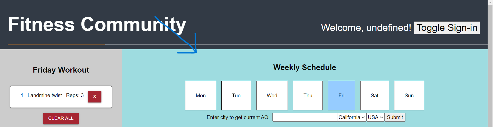

# Fitness Community

We were motivated to create a social experience where users could share, educate, and encourage each other on their individual fitness journeys. We wanted an easy way for users to create a routine and stick to it, focusing on the ability to create workouts and discover new exercises. 

As we began to research, test, and iterate, we determined that the social aspect of the app would require server-based technologies, and we decided that this fell outside the scope of this particular sprint. We chose instead to focus on an individual user’s experience. Specifically, we focused on the ability to create a regular, weekly workout schedule, and an in-app feature to lookup new exercises based on a set of user-provided criteria.

In its current state, Fitness Community allows you to schedule your weekly workout. On each day of the week, you can add exercises to your workout routine. If you need ideas, there is already an exercise idea generator! Users can also enter their location data to get the current Air Quality Index.

[Visit the deployed application here.](https://408broncos.github.io/fitness-community)


---
## User Stories
```
AS A potential workout enthusiast
I WANT to get a list of exercises that I may not be familar with
    SO THAT I can plan a workout that suits my preferences
I WANT see the details of those exercises
    SO THAT I can decide if I want to add them to my workout (and then add them)
I WANT to add those workouts to a weekly schedule
    SO THAT I can easily refer to each day’s workout plan, removing the need to reinvent my workout each day and allowing me to better develop a routine
I WANT to see the air quality forecast for the current day
    SO THAT I can adjust my workouts based on air quality
I WANT to create a login
    SO THAT I can have a unique experience, save my workouts, and - in future iterations - share workouts and interact with other app users
```
---
## Our Approach

We worked collaboratively over the course of this initial sprint, doing our best to follow agile software development practices.
[Agile Development](https://www.agilealliance.org/agile101/)

We generally followed the cycle below:
- Brainstorm
  - What ideas do we have?
  - What do we want?
  - Dream big!
- Discuss
  - How do we think we can accomplish this?
  - What do we think will be the components/steps?
- Research & Report Back
  - How have other people approached the problem?
  - What tools are already out there?
  - Teach back / Discuss
  - Do we still think this idea will work?
- Try it Out!
  - Create a test environment
  - Work through some examples, explore documentation
  - Break things
  - Teach back / Discuss
  - Do we still think this idea will work?
- Implement
  - Add it to the project!
  - Teach back / Discuss
  - Brainstorm

---
## Third Party APIs

Based on our user stories, we broke up the project into features, two of which required that we `fetch` data from outside sources.

### Getting a List of Exercises (Exercises API)

Research turned up an **Exercises API** provided by [API Ninjas](https://api-ninjas.com/api/exercises).  The API accepts a number of parameters, which we exposed for user input.

Base url: `https://api.api-ninjas.com/v1/exercises?`
Parameters: `name, type, muscle, difficulty`

The response contains an array of exercise objects:
```json
{
    "name": "Incline Hammer Curls",
    "type": "strength",
    "muscle": "biceps",
    "equipment": "dumbbell",
    "difficulty": "beginner",
    "instructions": "long long string of text"
  }
```

### Getting the Air Quality Index (AirVisual API)

We found that [IQAir](https://api-docs.iqair.com/) provided a free-tiered version of their **AirVisual API**, so we chose to implement that. The request takes in a city, state, and country and returns the current AQI (as well as some other weather data).

Base url: `http://api.airvisual.com/v2/city?city={{city}}&state={{state}}&country={{country}}&key={{YOUR_API_KEY}}`
Parameters: `city, state, country`
Sample response snippet:
```json
"current": {
      "weather": {
        "ts": "2019-08-01T23:00:00.000Z",
        "tp": 37,
        "pr": 1007,
        "hu": 14,
        "ws": 1,
        "wd": 110,
        "ic": "01d"  <- Weather Icon
      },
      "pollution": {
        "ts": "2019-08-04T19:00:00.000Z",
        "aqius": 70,  <- US Air Quality Index
        "mainus": "p2",
        "aqicn": 30,
        "maincn": "p2",
        "p2": {
          "conc": 21,
          "aqius": 70,
          "aqicn": 30
        },
```
### HTML

Created forms where the user can sign up if they are a first time user or simply login if they are a returning user.


### Javascript Libraries (jBox)

Because the Exercises API returns exercises we decided to add modals that pops up with an excercises name, level of difficulty, equipment needed if any, what muscle it targets, what exercise type it is and a instructions for how to do the workout. You also get to choose the amount of reps that you want for that workout and you get to choose if you want to add the workoout to your daily workout schedule or not.


### Day.js

We used Day.js to setup our weekly schedule. We get days Monday through Sunday and the current day is highlighted in blue.




### 
TODO:
Technologies used
Supportive Gif of that feature
Any relevant code snippets - Description of why it is significant
Description of CSS framework used (links to Docs)
Gif of site at different screen sizes
Learning Objectives
Authors / Contact


### Firebase Authentication

Because our initial vision for the application centered around a social experience - things like sharing and liking posts, commenting on workouts, etc. - we had looked at Firebase as a


## CSS Framework (Tachyons)

We used the [Tachyons CSS Toolkit](http://tachyons.io/) as a framework. As a team, most of our experience using CSS frameworks has been with Bootstrap, so we wanted to explore other options. 

We settled on Tachyons because it had a nice balance of features and styling. We wanted to lay things out quickly and not get bogged down in CSS, so we looked for a framework that gave us easy controls over flexbox, sizing, spacing, and a few colors.

The responsive properties in Tachyons are a little stiff, but it was fine for these purposes.

